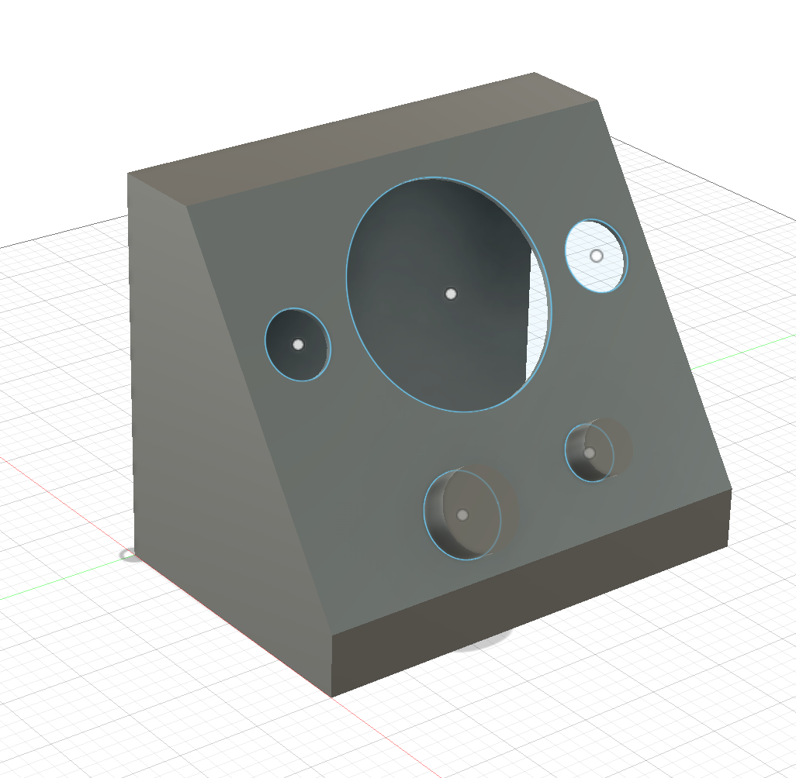

# Cosmo Pager Radio

可穿梭于平行宇宙的 Radio 接收器

## 项目简介

本项目是一个硬件改装项目，将 E5 Ultra 安卓掌机改造为具有复古 Radio 外观的桌面交互设备。设备造型参考 iMac G3 的斜面站立式设计，通过 3D 打印外壳和自定义输入系统，打造独特的交互体验。

用户可以通过旋转旋钮来调节频率、切换模式，仿佛在不同的平行宇宙间搜索信号。

## 产品形态



- **外观风格**: iMac G3 斜面站立式
- **显示设计**: 三圆形遮罩（一个矩形屏幕通过开孔分割为三个圆形显示区）
  - 中间大圆：主显示区
  - 左侧小圆：模式指示
  - 右侧小圆：频率指示
- **输入方式**: 两个 EC11 旋钮 + 顶部条状按钮

## 硬件组成

| 组件 | 规格 | 用途 |
|------|------|------|
| E5 Ultra | 5寸IPS屏/T620芯片/6+128G/5000mAh | 主机，运行 Web 应用 |
| Adafruit HUZZAH32 | ESP32 WROOM32/BT+WiFi | 蓝牙 HID 控制器 |
| EC11 旋钮 x2 | 旋转编码器 | 频率调节/模式切换 |
| 微动开关 x1 | 顶部条状按钮 | 确认操作 |

## 交互设计

输入设备通过 ESP32 蓝牙 HID 协议连接到 E5 Ultra 的安卓系统，模拟键盘按键：

| 输入 | 映射 | 功能 |
|------|------|------|
| 顶部按钮 | Enter 键 | 确认选择 |
| EC11 #1 旋转 | 上/下方向键 | 调节频率 |
| EC11 #2 旋转 | 左/右方向键 | 切换模式 |

## 项目结构

```
cosmo-pager-radio-demo/
├── README.md                           # 本文档
├── CLAUDE.md                           # Claude Code 开发指南
├── docs/
│   ├── design/
│   │   └── hardware-architecture.md    # 硬件架构设计
│   ├── E5Ultra/                        # E5 Ultra 设备资料
│   │   ├── README.md
│   │   └── *.png/jpg                   # 设备图片
│   └── references/                     # 参考资料
│       ├── adafruit-huzzah32.md        # HUZZAH32 引脚与开发参考
│       └── esp-idf-bluetooth-hid.md
└── firmware/                           # ESP32 BLE HID 固件
    ├── main/
    │   ├── esp_hid_device_main.c       # 主程序：GPIO 输入 + HID 发送
    │   ├── esp_hid_gap.c               # BLE GAP/GATT 连接管理
    │   └── CMakeLists.txt
    ├── sdkconfig.defaults              # 构建配置（NimBLE + 键盘模式）
    └── CMakeLists.txt
```

## 相关项目

- [cosmo-pager-web-nextjs-vercel](https://github.com/RogerHao/cosmo-pager-web-nextjs-vercel) - Web 应用前端（由软件团队开发）

## 项目状态

- [x] 硬件方案设计
- [x] 外壳 3D 建模（进行中）
- [x] ESP32 供电方案验证
- [x] ESP32 固件开发 - GPIO 输入 + BLE HID 键盘
- [ ] 硬件接线与功能测试
- [ ] 外壳 3D 打印与组装
- [ ] 整机调试

### 固件功能

当前固件实现：
- BLE HID 键盘设备（NimBLE 协议栈）
- 两个 EC11 旋转编码器输入（Gray Code 解码）
- 一个按钮输入
- 10ms 轮询周期，内部上拉电阻

构建与烧录：
```bash
cd firmware
get_idf                                    # 激活 ESP-IDF 环境
idf.py build                               # 构建
idf.py -p /dev/cu.usbserial-0001 flash     # 烧录
```

## 文档索引

- [硬件架构设计](docs/design/hardware-architecture.md)
- [E5 Ultra 设备参考](docs/E5Ultra/README.md)
- [Adafruit HUZZAH32 参考](docs/references/adafruit-huzzah32.md)
- [ESP-IDF 蓝牙 HID 参考](docs/references/esp-idf-bluetooth-hid.md)
