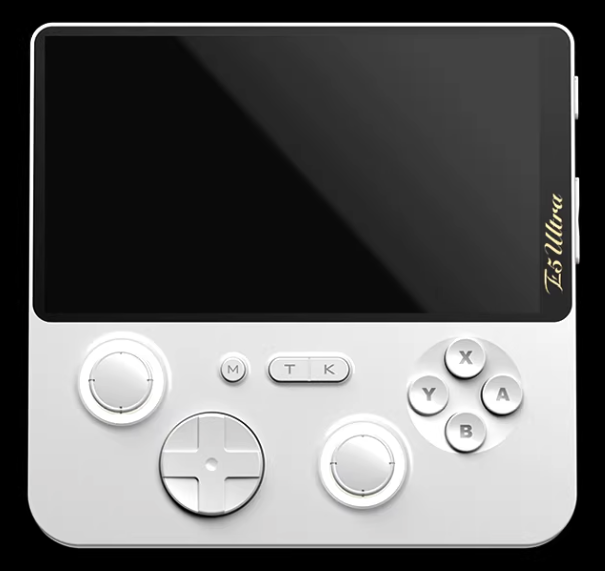
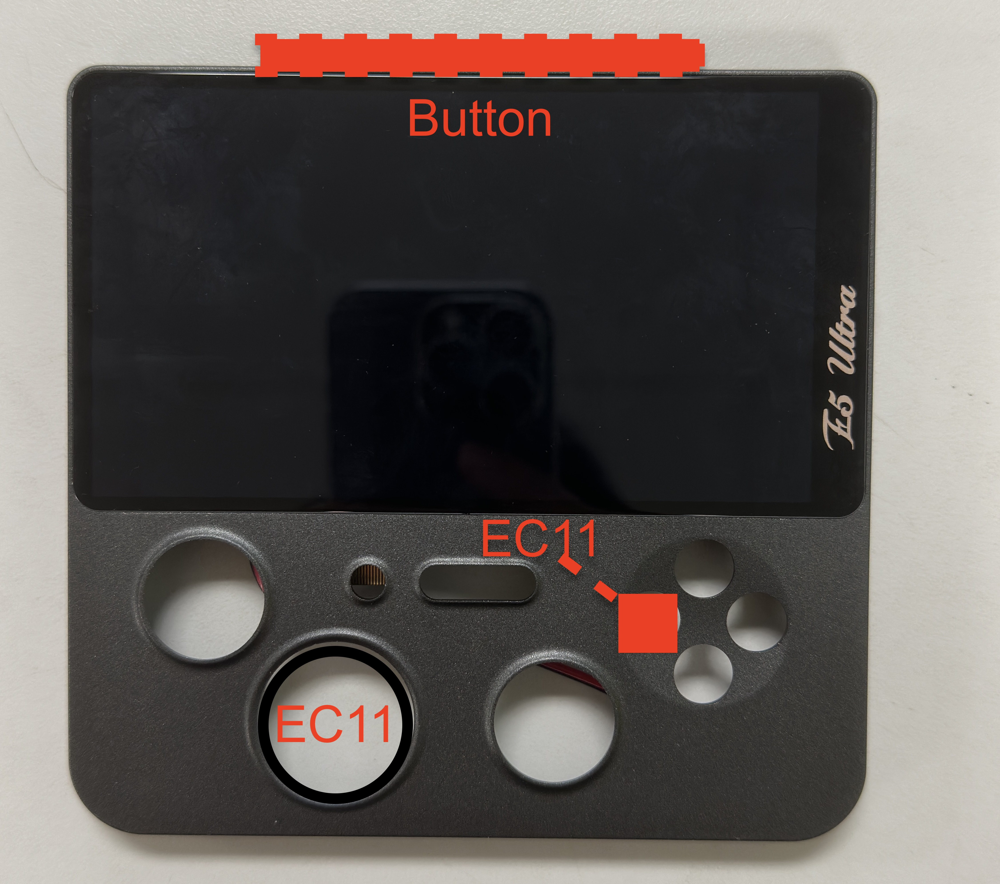

# E5 Ultra 设备参考

## 设备概述

E5 Ultra 是一款安卓游戏掌机，本项目将其改造为桌面式 Radio 接收器的主机部分。

## 规格参数

| 类别 | 规格 |
|------|------|
| **处理器** | T620 芯片，8核 A75+A55 CPU |
| **内存/存储** | 6GB RAM + 128GB 存储 |
| **屏幕** | 5寸 IPS 全贴屏 |
| **分辨率** | 1280 x 720 (16:9) |
| **刷新率** | 60Hz |
| **亮度** | 450nit，可调光 |
| **色域** | RGB 98% 覆盖 |
| **电池** | 5000mAh |
| **马达** | 线性马达 |
| **端口** | USB-C 4.0 x1 / 3.5mm 音频 x1 / TF 卡槽 x1 (micro SD 4.0) |
| **无线** | 5G WiFi / 2.4G WiFi / 蓝牙 |

## 本项目使用方式

### 保留组件
- 屏幕模组（5寸 IPS）
- 主板及芯片组
- 电池（5000mAh）
- USB-C 接口
- WiFi/蓝牙模块

### 移除组件
- 后壳
- 下方物理按键区域
- 原有输入控制板

### 改造后状态

改装后只保留前壳+屏幕+主板，下方原有按键区域的开孔将用于安装两个 EC11 旋钮。

## 供电取电点

从主板测试点取电，为外接 ESP32 控制器供电：
- 电压：3.5V ~ 3.7V（电池电压）
- 接入 ESP32 的 BAT 引脚

## 软件环境

- 操作系统：Android
- 浏览器：Fully Kiosk Browser（Kiosk 模式运行 Web 应用）
- 蓝牙：支持 HID 设备连接

## 外壳设计

新外壳采用 3D 打印，E5 Ultra 的前壳将贴合在新外壳正面，通过三个圆形开孔展示屏幕内容。
